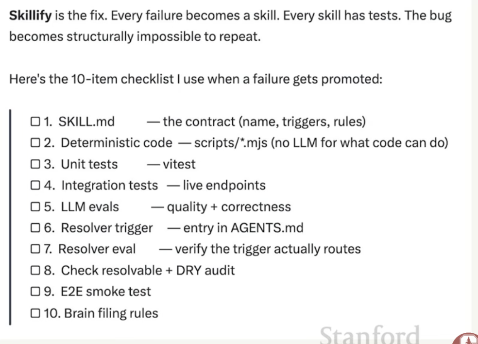
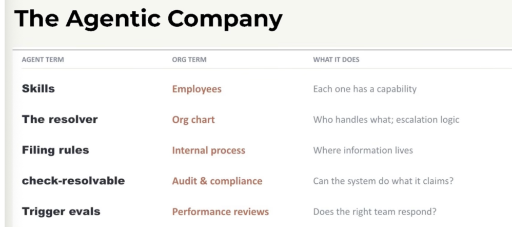
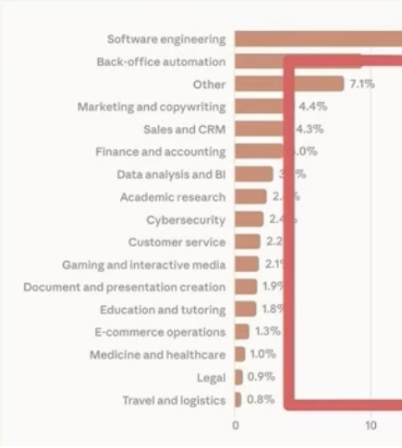

YC says they fixed the VC era by implementing standards for investments
- they inherently lead to the infinite growth for startups by making it more accessible

# how do i get my company to be AI native
Shift your company from loss open loop to closed loops
- AI agent have read access to all corporate artifacts to flatten middle management

So your teams get smaller, and moves into a software factory instead of AI copilot
- so your agents should have personas to help iterate faster:
What should we build > office_hours
How big could it be > plan ceo review
Make user happy > okab ebg review
Ship > reflect , etc.

We need LLMs and Code to work together, to fill in their weaknesses
- LLMs good at reading, synthesizing, and decisions
- Code is deterministic
We use a Skills file, gives the runbook of what the agent or human should do
- If this file gets too large, use a resolver (basically simplify the skills further and let the LLM reason)

# so what does the agentic company look like?

also without humans you can improve in different ways:
- capture failures and turn it into eval cases for your AI

# Now is the best time to start a company
How? - pick one painful workflow, go live in the customer, and become the forward deployed engineer
Voice agents for loan servicing: salient has deals with US banks
Logistics voice, with truck workers: Happyrobot
Document parsing: reducto. AI tool growth

## Memory is the next brain - my project is called gbrain and it has 3 layers
- the problem? Simple knowledge wikis run out of steam or "fall over" because relying strictly on basic LLM processing is not enough to accurately retain and retrieve complex context over time

So i Built GBRAIN:
(designed to store knowledge, track specialized ideas (like a founder's unique hunches), and capture exactly what is happening in a workflow)
L1 - brain. Just markdown files with info
L2 - retrieval. Postgres + pgvector
L3 - agent skills. MCP server, and a bunch of typed tools. Use skillify here 

# what fields are left that havent been exposed to AI agents
software engineering is getting oversatured, but here are more options:
